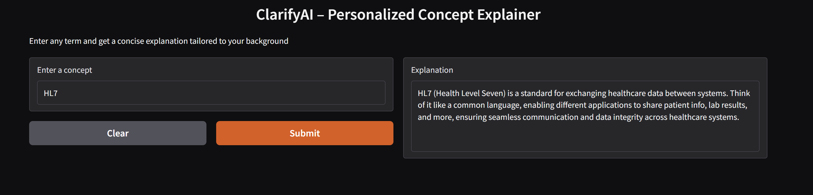

# ClarifyAI

"Because Googling things is so 2020."

 

 

**Live demo:** http://clarifyai-env.eba-bp36ymzk.us-east-1.elasticbeanstalk.com

## What it does

Type any term and get a concise, contextual explanation tailored to an aspiring AI/Data Engineer. Explanations prioritize practical relevance for Healthcare and Mining applications.

## Why I built it

Built to practice rapid end-to-end prototyping skills important for AI Engineer and Forward Deployment Engineer roles — from idea to deployed app.

## Features

- Concise, role-focused explanations
- Domain emphasis: Healthcare & Mining
- Lightweight web UI (Gradio)
- Uses LangChain + Groq LLM for fast iteration

## Tech stack

- LangChain
- Groq (free LLM API)
- Gradio
- Python
- AWS Elastic Beanstalk (deployment)
- AWS CloudWatch (monitoring)

## Deployment

Deployed on AWS Elastic Beanstalk. Monitoring is configured via AWS CloudWatch. See `Procfile` and `requirements.txt` for deployment details.

## Usage

Type a concept (e.g., "federated learning") and optionally mention the domain (Healthcare or Mining) to receive a concise, practical explanation and suggested next steps for implementation or evaluation.

---

Built by Nupur Gudigar - Aspiring AI/Data Engineer passionate about building AI tools for Healthcare and Mining industries. Currently learning AI Engineering through rapid prototyping.

[LinkedIn](www.linkedin.com/in/nupur-gudigar)

